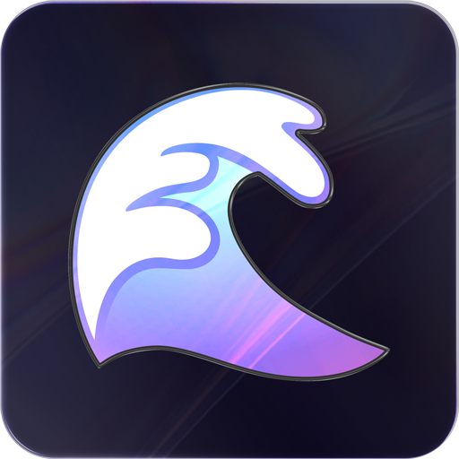

<p align="center">
  
</p>

<h1 align="center">VIOVNL.Flowy.Blazor</h1>

<p align="center">
  <a href="https://github.com/VIOVNL/Flowy.Blazor/actions/workflows/ci-build.yml"></a>
  <a href="https://www.nuget.org/packages/VIOVNL.Flowy.Blazor"></a>
  <a href="https://www.nuget.org/packages/VIOVNL.Flowy.Blazor"></a>
  <a href="https://github.com/VIOVNL/Flowy.Blazor/blob/main/LICENSE"></a>
  <a href="https://dotnet.microsoft.com/download"></a>
</p>

<p align="center">
A beautiful and interactive hierarchical tree visualization component for Blazor applications. Perfect for building family trees, organization charts, decision trees, and any hierarchical data structure with an intuitive drag-and-drop interface.
</p>

---

## ✨ Features

- 🎯 **Drag & Drop** - Intuitive node manipulation with visual drop zones
- 🔄 **Auto Layout** - Automatic hierarchical positioning with smooth animations
- 🔍 **Zoom & Pan** - Interactive canvas navigation with momentum scrolling
- 🎨 **Custom Templates** - Rich Blazor RenderFragment support for node content
- 💾 **JSON Serialization** - Export and import entire tree structures
- ⚡ **High Performance** - ES6 modular architecture with optimized rendering
- 🎭 **Two-Way Binding** - Reactive parameters with `@bind-ZoomLevel` support
- ✅ **Validation System** - Custom drop target validation with callbacks
- 💧 **Visual Effects** - Built-in droplet flow animations along tree paths
- 🔒 **Node Control** - Granular control over draggability and child acceptance
- 📊 **Comprehensive Events** - Rich event system for tracking all interactions

## 📦 Installation

```bash
dotnet add package VIOVNL.Flowy.Blazor
```

Or via Package Manager Console:

```powershell
Install-Package VIOVNL.Flowy.Blazor
```

## 📚 Documentation

For detailed usage instructions, configuration options, and examples, see the **[Complete Documentation →](Documentation.md)**


## 📄 License

This project uses a **dual licensing model**:

### Open Source License (GPL v3)
If you are creating an open source application under a license compatible with the GNU GPL license v3, you may use this project under the terms of the GPLv3. See [LICENSE](../LICENSE) file for full details.

### Commercial License
If you want to use Flowy.Blazor to develop commercial sites, themes, projects, and applications, the Commercial license is the appropriate license. With this option, your source code is kept proprietary.

**[Purchase Commercial License →](https://www.viov.nl/)**

## 🤝 Contributing

Contributions are welcome! Please feel free to submit a Pull Request.

## 🔗 Links

- **Repository:** [https://github.com/VIOVNL/Flowy.Blazor](https://github.com/VIOVNL/Flowy.Blazor)
- **Issues:** [https://github.com/VIOVNL/Flowy.Blazor/issues](https://github.com/VIOVNL/Flowy.Blazor/issues)
- **NuGet:** [https://www.nuget.org/packages/VIOVNL.Flowy.Blazor](https://www.nuget.org/packages/VIOVNL.Flowy.Blazor)

---

